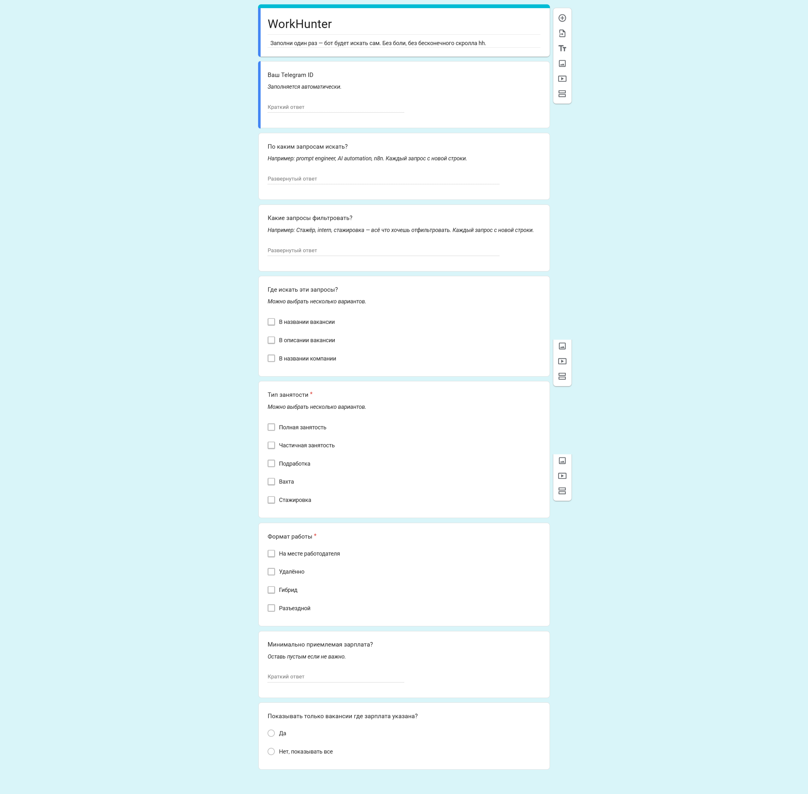

# WorkHunter

**WorkHunter** — AI-ассистент для поиска работы в виде Telegram-бота. Он автоматизирует весь процесс: собирает резюме и предпочтения, парсит вакансии с HH.ru и оценивает их с помощью LLM — так что тебе приходят только те вакансии, которые реально подходят.

Реализован как единый воркфлоу на [n8n](https://n8n.io/) — подходит для self-hosted и облачного развёртывания.

---

## Как это работает

```
Пользователь пишет боту в Telegram
        ↓
Telegram Trigger → Роутер команд
    ├── /start           → Приветствие + ссылка на Google Form (настройки)
    ├── Файл резюме      → Извлечение текста, сохранение в БД
    ├── /search          → Парсинг вакансий → AI-матчинг → отправка результатов
    ├── /update_resume   → Запрос нового файла
    ├── /update_prefs    → Повторная ссылка на Google Form
    └── /help            → Список команд
```

### Пайплайн поиска и матчинга

1. Предпочтения пользователя (ключевые слова, зарплата, тип занятости, график) собираются через Google Forms и хранятся в DataTables n8n.
2. По команде `/search` бот формирует запрос к [API HH.ru](https://api.hh.ru/) и получает до 1 000 вакансий.
3. Новые вакансии (ещё не встречавшиеся) сохраняются и поочерёдно сравниваются с резюме пользователя через **Google Gemini** (OpenRouter).
4. LLM возвращает **оценку совпадения (0–100)** с коротким объяснением. Вакансии с оценкой ≥ 60 отправляются пользователю в Telegram.

---

## Возможности

- **Загрузка резюме** — отправь файл `.txt` или `.docx` прямо в чат
- **Форма предпочтений** — Google Form с предзаполненным chat ID для удобной настройки
- **Умный конструктор запросов** — преобразует типы занятости и графика в коды API HH.ru, поддерживает исключение слов
- **Дедупликация** — одна и та же вакансия никогда не обрабатывается дважды
- **AI-оценка** — структурированный вывод LLM: балл, флаг совпадения и пояснение в 2 предложениях
- **Логирование** — все действия пишутся в DataTable (команда, статус, детали)

---

## Стек технологий

| Уровень | Инструмент |
|---|---|
| Движок воркфлоу | [n8n](https://n8n.io/) |
| Мессенджер | Telegram Bot API |
| Рынок труда | [API HeadHunter (HH.ru)](https://api.hh.ru/) |
| AI-модель | Google Gemini через [OpenRouter](https://openrouter.ai/) |
| Онбординг | Google Forms |
| Хранилище | n8n DataTables |

---

## Быстрый старт

### Требования

- Запущенный инстанс [n8n](https://docs.n8n.io/hosting/) (self-hosted или облако)
- Токен Telegram-бота ([BotFather](https://t.me/BotFather))
- API-ключ [OpenRouter](https://openrouter.ai/) (для доступа к Gemini)
- Google Form для сбора предпочтений (структура ниже)

### Установка

1. Скачай или склонируй репозиторий, возьми файл `WorkHunter.json`.
2. В n8n: **Workflows → Import** → загрузи `WorkHunter.json`.
3. Настрой учётные данные:
   - **Telegram Bot** — вставь токен бота
   - **OpenRouter** — добавь API-ключ как HTTP Header Auth credential
4. Создай Google Form с полями из таблицы ниже. В файле `WorkHunter.json` найди плейсхолдеры и замени их на свои ссылки:
   - `YOUR_GOOGLE_FORM_PREFILL_URL` — ссылка на предзаполнение твоей формы (используется в нодах `/start` и `/update_prefs`)
   - `YOUR_GOOGLE_SHEET_URL` — ссылка на таблицу Google Sheets, куда форма пишет ответы
   - `YOUR_ENTRY_ID` — ID поля chat_id в твоей форме (находится в URL предзаполнения)
5. Активируй воркфлоу.

### Поля Google Form



| Поле | Тип |
|---|---|
| Chat ID | Краткий ответ (предзаполняется) |
| Ключевые слова для поиска | Краткий ответ |
| Слова-исключения | Краткий ответ |
| Тип занятости | Флажки (полная, частичная, проектная…) |
| График работы | Флажки (офис, удалённо, гибкий…) |
| Минимальная зарплата | Краткий ответ |
| Только с указанной зарплатой | Флажок |
| Искать в | Флажки (название, описание, название компании) |

---

## Команды бота

| Команда | Описание |
|---|---|
| `/start` | Запустить бота, получить форму предпочтений |
| Отправить `.txt` / `.docx` | Загрузить или обновить резюме |
| `/search` | Запустить поиск с текущими настройками |
| `/update_resume` | Заменить сохранённое резюме |
| `/update_prefs` | Обновить предпочтения по поиску |
| `/help` | Показать список команд |

---

## Структура проекта

```
WorkHunter/
└── WorkHunter.json   # экспорт воркфлоу n8n — импортируй в свой инстанс
```

---

## Заметки

- Интеграция с рынком труда заточена под **HH.ru** — крупнейший джоб-борд России и СНГ.
- Бот общается в саркастичном стиле и не упустит возможности поиронизировать над рынком труда.
- LLM-запросы используют структурированный вывод с повторными попытками (3 попытки, задержка 3 с) для обработки ошибок парсинга.

---

## Лицензия

MIT
